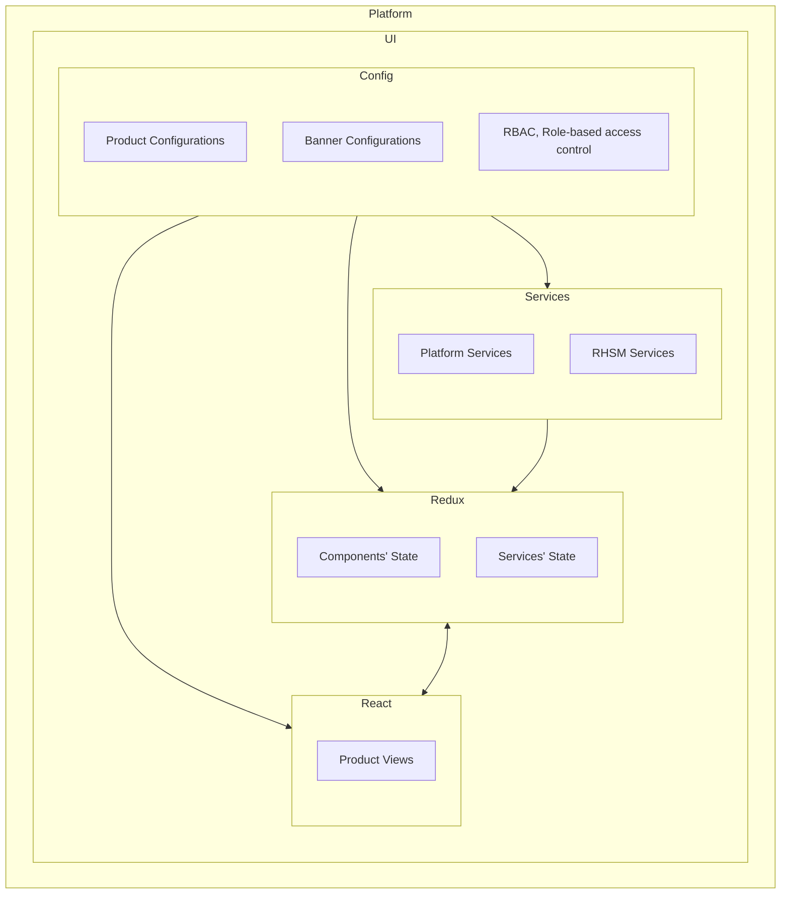
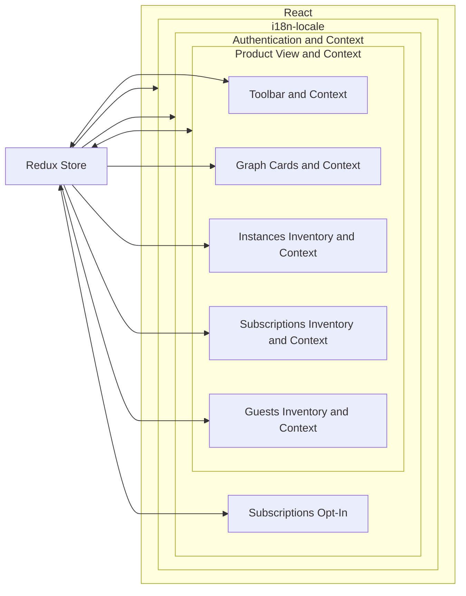
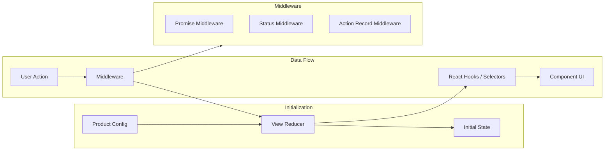
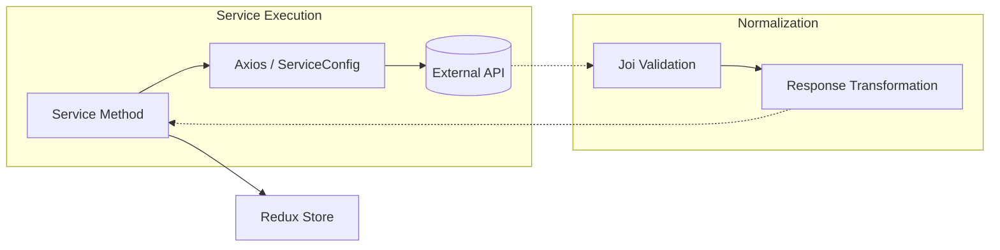

# Architecture and design

Curiosity Frontend is a React-Redux application built for the Red Hat Hybrid Cloud Console. It follows a layered architecture to separate data fetching, state management, and UI rendering.

## System Overview

### Config
The configuration layer (found in [`src/config/`](../src/config/)) defines product-specific behavior and sets global constants.

- **Products**: Configuration files that specify seed metrics, filters, and inventory tabs for each product (RHEL, OpenShift, etc.). Integrated into the React and Redux state layer.
- **Banners**: Configuration for banner messages and notifications. Integrated into the React and Redux state layer.
- **RBAC**: Configuration for role-based access control (RBAC) permissions and policies. Integrated into the React, Redux state, and service layer.

### React
React is organized into top-level **Product Views** with primary groupings for **toolbar**, **graphs**, and **inventory displays**.

- Subscriptions opt-in is an alternative view driven by RHSM API HTTP response. Originally intended to help throttle usage while the application built out infrastructure. It is being considered for deprecation.
- Extensive use of **React context and hooks** integrated with **Redux state** is what drives the **Toolbar filters** to provide updates across the application display.
- Lifecycle hooks (e.g. `useEffect`, `useMemo` placed in `context` suffixed files like `[aComponent]Context`) and component display logic have been separated with dependency injection to enable better testability, "potential" reusability, and maintainability.
- Redux enables the application to drive components that are not part of the immediate component context.
- Each component grouping has its own level of debugging/error card display, typically driven by HTTP status on RHSM responses. This is possible because of how lifecycle hooks and component display have been separated and integrated via Redux state.

### Redux and state
Global state is managed by Redux, handling everything from API responses to user preferences.

- Services are integrated into React lifecycle hooks (e.g. through suffixed files like `[aComponent]Context`) through middleware, Redux helpers found in [`src/redux/common/reduxHelpers.js`](../src/redux/common/reduxHelpers.js), and promise hooks found in [`src/redux/hooks/useReactRedux.js`](../src/redux/hooks/useReactRedux.js)

### Services
The services layer (found in [`src/services/`](../src/services/)) manages all external communication. It normalizes raw API responses into a consistent format used by Redux.

- RHSM service responses are cached using `LRU Cache` (typically 10–30 seconds). This mechanism reduces repeated API calls for unchanged displays and improves performance. Cache keys are generated based on toolbar and display filters.
- Response transformations are leveraged extensively instead of Redux state mutation. This design decision is primarily driven by:
   - The ability to integrate transformed API responses into the response caching mechanism using `LRU Cache`.
   - "State" for API responses should be "mostly" immutable, Redux state is a gateway.
   - React should be focused on display.
   - If API responses are altered in future API updates, the transformations can provide normalization and prevent breaking changes to the application.

> Services attempt to pipe certain global methods provided by the platform to align with how data enters Redux state. This was an early design decision meant to bring some level of order and track "global methods" being provided ad-hoc by the platform.
> 
> Newer platform methods "mostly" make use of React hooks, which provide a much better tracking experience for consuming application displays.
> 
> Platform methods still being flowed through the service layer can be found under [`src/services/platform/`](../src/services/platform/) where they are normalized/transformed to expected response structures before being flowed back into Redux state for stability. 

