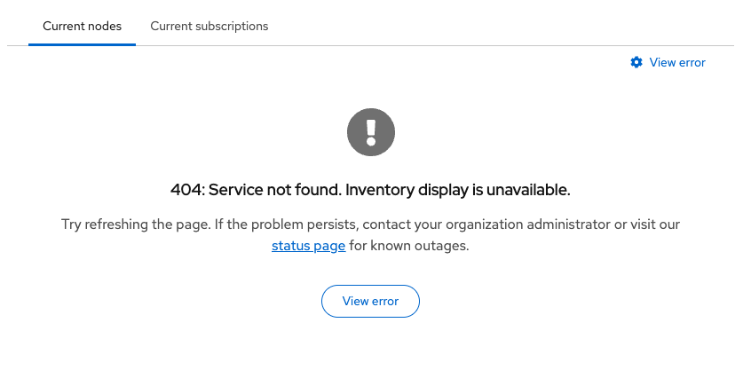
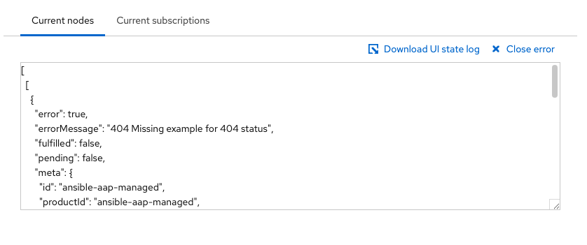

# Developer reference

Guide to Curiosity's development process and reference documentation.

- [Getting started](#getting-started)
- [Build](#build)
- [Platform integration](#platform-integration)
- [Development methodology and teams](#development-methodology-and-teams)
- [Debugging](#debugging)
- [React components](#react-components)
- [Redux and state management](#redux-and-state-management)
- [Services](#services)
- [AI tools](#ai-tools)

## Getting started

### Running local development
This is a non-networked local run designed to function with minimal resources, a mock API, and a standalone Webpack dev server that leverages the same production configurations using [`Weldable`](https://github.com/cdcabrera/weldable).

1. Confirm you've installed all recommended tooling
1. Confirm you've installed resources through npm
1. Create a local dotenv file called `.env.local` in the root of Curiosity, and add the following contents
    ```
    REACT_APP_DEBUG_MIDDLEWARE=true
    REACT_APP_DEBUG_ORG_ADMIN=true
    REACT_APP_DEBUG_PERMISSION_APP_ONE=subscriptions:*:*
    REACT_APP_DEBUG_PERMISSION_APP_TWO=inventory:*:*
    ```
1. Open a couple of instances of Terminal and run...
   ```
   $ npm start
   ```
   and, optionally,
   ```
   $ npm run test:dev
   ```
   > If issues occur with the mock server port `3030`, you can set a custom port by exporting a parameter before starting the server.
   > i.e., `$ export MOCK_PORT=5000; npm start`

1. Make sure your browser opened around the domain `https://localhost:3000/`
1. Start developing...

> The UI uses basic permissions in certain components to adjust the display. You can adjust permissions during development
> by adding in 3 dotenv params to a gitignored `.env.local` file in the root of the repository, similar to the `REACT_APP_DEBUG_MIDDLEWARE`
> mentioned above.
>
> The 3 dotenv params below are...
> - REACT_APP_DEBUG_ORG_ADMIN
> - REACT_APP_DEBUG_PERMISSION_APP_ONE
> - REACT_APP_DEBUG_PERMISSION_APP_TWO
>
> The `REACT_APP_DEBUG_ORG_ADMIN` was previously used as a convenience parameter for determining if a user is the organization admin used during the "opt-in" process.
> It may no longer be actively used.
>
> The remaining 2 parameters are actively used during development. To apply development read-only permissions set the params as...
> ```
> REACT_APP_DEBUG_PERMISSION_APP_ONE=subscriptions:reports:read
> REACT_APP_DEBUG_PERMISSION_APP_TWO=inventory:reports:read
> ```
>
> You will have to rerun the local run "start command" for the changes to be applied.

### Running proxy development
This is a networked run that has the ability to proxy production, stage, and ephemeral with a live API.

1. Confirm you've installed all recommended tooling
1. Confirm you've installed resources through npm
1. Create a local dotenv file called `.env.local` in the root of Curiosity, and add the following contents
    ```
    REACT_APP_DEBUG_MIDDLEWARE=true
    ```
1. **Confirm you are connected to the network**
1. Open a couple of instances of Terminal and run...
    ```
    $ npm run start:proxy
    ```
   and, optionally,
    ```
    $ npm run test:dev
    ```
1. Make sure you open your browser around the domain `https://*.foo.redhat.com/`
   > You may have to scroll, but the terminal output will have some available domains for you to pick from.
1. Start developing...

## Build

### Webpack and Consoledot configuration
Webpack configuration leverages the NPM package [`Weldable`](https://github.com/cdcabrera/weldable) to integrate with Consoledot Webpack configuration.

Weldable is used to:
- Provide a single NPM install point for most Webpack packages, reducing the number of direct dependencies in `package.json`.
- Enable local, non-networked runs of the UI with API mocks. Since Weldable leverages production Webpack configurations, the application can be viewed without Consoledot branding or influence.

For details on mocking APIs see [Mocking service responses](#mocking-service-responses)

### NPM scripts
Updated NPM scripts can be found in [package.json](../package.json). The most essential scripts are listed below to provide immediate context for agents and new developers.

| Script                         | Description                                                                                      |
|--------------------------------|--------------------------------------------------------------------------------------------------|
| `npm install`                  | Install project dependencies.                                                                    |
| `npm start`                    | Run the local development server with mock API responses.                                        |
| `npm run start:proxy`          | Run the development server with a live API proxy.                                                |
| `npm test`                     | Run the full test suite (lint, spell check, and unit tests).                                     |
| `npm run test:dev`             | Run unit tests in watch mode during development.                                                 |
| `npm run test:integration-dev` | Run integration tests in watch mode, typically after running the build and having checks fail. |
| `npm run build`                | Compile the application and run integration tests for production readiness.                      |
| `npm run build:docs`           | Run spelling, linting, and regenerate documentation READMEs from JSDoc.                          |
| `npm run release`              | Generate CHANGELOG.md, update package.json and package-lock.json semver versions.                |

### Environment variables (dotenv)
dotenv files within this repository are leveraged for application configuration only and contain no secrets or sensitive information.

#### Structure
The dotenv files are structured to cascade each additional dotenv file settings from a root `.env` file.
```
 .env = base dotenv file settings
 .env.local = a gitignored file to allow local settings overrides
 .env -> .env.development = local run development settings that enhances the base .env settings file
 .env -> .env.proxy = local run proxy settings that enhances the base .env settings file
 .env -> .env.production = build modifications associated with all environments
 .env -> .env.production.local = a gitignored, dynamically generated build modifications associated with all environments
 .env -> .env.test = testing framework settings that enhances the base .env settings file
```

#### Available _developer/debugging/test_ dotenv parameters

> Technically all dotenv parameters come across as strings when imported through `process.env`. It is important to cast them accordingly if "type" is required.

| dotenv parameter                   | definition                                                                                                                                                                     |
|------------------------------------|--------------------------------------------------------------------------------------------------------------------------------------------------------------------------------|
| DEV_PORT                           | A local proxy build modification for running against a custom port                                                                                                             |
| DEV_BRANCH                         | A local proxy build modification for running against a custom environment branch. Available options include `stage*`, `prod*`                                                  |
| GENERATE_SOURCEMAP                 | A static boolean that disables local run source map generation only. May speed up local development re-compiles. May eventually be moved into `.env.development`.              | 
| REACT_APP_DEBUG_DEFAULT_DATETIME   | A static string associated with overriding the assumed UI/application date in the form of `YYYY-MM-DD`                                                                         |
| REACT_APP_DEBUG_MIDDLEWARE         | A static boolean that activates the console state debugging messages associated with Redux.                                                                                    |
| REACT_APP_DEBUG_ORG_ADMIN          | A static boolean associated with local development only that overrides the organization admin. Useful in determining UI/application behavior when permissions are missing.     |
| REACT_APP_DEBUG_PERMISSION_APP_ONE | A static string associated with local development only that overrides RBAC associated permissions. Useful in determining UI/application behavior when permissions are missing. |
| REACT_APP_DEBUG_PERMISSION_APP_TWO | A static string associated with local development only that overrides RBAC associated permissions. Useful in determining UI/application behavior when permissions are missing. |

#### Available _build_ dotenv parameters

> Technically all dotenv parameters come across as strings when imported through `process.env`. It is important to cast them accordingly if "type" is required.

| dotenv parameter                                  | definition                                                                                                                                                     |
|---------------------------------------------------|----------------------------------------------------------------------------------------------------------------------------------------------------------------|
| REACT_APP_UI_VERSION                              | A dynamically build populated package.json version reference                                                                                                   |
| REACT_APP_UI_NAME                                 | A static string populated reference similar to the consoledot application name                                                                                 |
| REACT_APP_UI_DISPLAY_NAME                         | A static string populated reference to the display version of the application name                                                                             |
| REACT_APP_UI_DISPLAY_CONFIG_NAME                  | A static string populated reference to the configuration version of the application name                                                                       |
| REACT_APP_UI_DISPLAY_START_NAME                   | A static string populated reference to the "sentence start" application name                                                                                   |
| ~~REACT_APP_UI_DEPLOY_PATH_PREFIX~~               | A legacy parameter. Originally, a dynamically build populated beta/preview environment path reference                                                                                          |                                                               
| ~~REACT_APP_UI_DEPLOY_PATH_LINK_PREFIX~~          | A legacy parameter. Originally, a dynamically build populated beta/preview environment path reference that may or may not be equivalent to `REACT_APP_UI_DEPLOY_PATH_PREFIX`                   |
| PUBLIC_URL                                        | A dynamically prefix populated reference to where the application lives on consoledot                                                                          |                                                                                                           
| REACT_APP_UI_LINK_CONTACT_US                      | A static contact us link for populating a link reference NOT directly controlled by the application and subject to randomly changing.                          |
| REACT_APP_UI_LINK_LEARN_MORE                      | A static learn more link for populating a link reference NOT directly controlled by the application and subject to randomly changing.                          |
| REACT_APP_UI_LINK_REPORT_ACCURACY_RECOMMENDATIONS | A static mismatched content link for populating a link reference NOT directly controlled by the application and subject to randomly changing.                  |
| REACT_APP_UI_DISABLED                             | A static boolean for disabling/hiding the entire UI/application                                                                                                |
| REACT_APP_UI_DISABLED_NOTIFICATIONS               | A static boolean for disabling/hiding consoledot integrated notifications/toasts                                                                               |
| REACT_APP_UI_DISABLED_TOOLBAR                     | A static boolean for disabling/hiding the UI/application product view primary toolbar                                                                          |
| REACT_APP_UI_DISABLED_TOOLBAR_GROUP_VARIANT       | A static boolean for disabling/hiding the UI/application group variant toolbar and group variant select list                                                   |
| REACT_APP_UI_DISABLED_GRAPH                       | A static boolean for disabling/hiding the UI/application graph card(s)                                                                                         |
| REACT_APP_UI_DISABLED_TABLE                       | A static boolean for disabling/hiding ALL UI/application inventory displays                                                                                    |
| REACT_APP_UI_DISABLED_TABLE_HOSTS                 | A static boolean for disabling/hiding ALL UI/application host inventory displays                                                                               |
| REACT_APP_UI_DISABLED_TABLE_INSTANCES             | A static boolean for disabling/hiding ALL UI/application instances inventory displays                                                                          |
| REACT_APP_UI_DISABLED_TABLE_SUBSCRIPTIONS         | A static boolean for disabling/hiding ALL UI/application subscription inventory displays                                                                       |
| REACT_APP_UI_LOGGER_ID                            | A static string associated with the session storage name of debugger log files                                                                                 |
| REACT_APP_UI_LOGGER_FILE                          | A static string associated with the session storage file name download of debugger log files.                                                                  |
| REACT_APP_UI_WINDOW_ID                            | A static string associated with accessing browser console UI/application methods such as `$ curiosity.UI_VERSION`                                              |
| REACT_APP_AJAX_TIMEOUT                            | A static number associated with the milliseconds ALL AJAX/XHR/Fetch calls timeout.                                                                             |
| REACT_APP_AJAX_CACHE                              | A static number associated with the milliseconds ALL AJAX/XHR/Fetch calls have their response cache timeout.                                                   |
| REACT_APP_AJAX_POLL_INTERVAL                      | A static number associated with the milliseconds ALL AJAX/XHR/Fetch export polling calls are called.                                                           |
| REACT_APP_SELECTOR_CACHE                          | Currently NOT used, originally associated with the cache, similar to `REACT_APP_AJAX_CACHE` but for transformed Redux selectors.                               |
| REACT_APP_CONFIG_EXPORT_EXPIRE                    | A static number used for the platform export data expiration.                                                                                                  |
| REACT_APP_CONFIG_EXPORT_FILE_EXT                  | A static string used for the platform export download file extension.                                                                                          |
| REACT_APP_CONFIG_EXPORT_FILE_TYPE                 | A static string used for the platform export download file MIME type.                                                                                          |
| REACT_APP_CONFIG_EXPORT_FILENAME                  | A static tokenized string used for the platform export download filename.                                                                                      |
| REACT_APP_CONFIG_EXPORT_SERVICE_NAME_PREFIX       | A static string used to prefix the platform export request name. Also used to filter and determine product identifiers combined with the export request name.  |
| REACT_APP_CONFIG_SERVICE_LOCALES_COOKIE           | A static string associated with the platform cookie name used to store locale information                                                                      |
| REACT_APP_CONFIG_SERVICE_LOCALES_DEFAULT_LNG      | A static string associated with the UI/application default locale language                                                                                     |
| REACT_APP_CONFIG_SERVICE_LOCALES_DEFAULT_LNG_DESC | A static string describing the UI/application default locale language                                                                                          |
| REACT_APP_CONFIG_SERVICE_LOCALES                  | A dynamically prefixed string referencing a JSON resource for available UI/application locales                                                                 |
| REACT_APP_CONFIG_SERVICE_LOCALES_PATH             | A dynamically prefixed string referencing JSON resources for available UI/application locale strings                                                           |
| REACT_APP_CONFIG_SERVICE_LOCALES_EXPIRE           | A dynamically prefixed string referencing the milliseconds the UI/application locale strings/files expire                                                      |
| REACT_APP_SERVICES_RHSM_VERSION                   | A static string referencing the RHSM API spec                                                                                                                  |
| REACT_APP_SERVICES_RHSM_REPORT                    | A static string referencing the RHSM API spec                                                                                                                  |
| REACT_APP_SERVICES_RHSM_TALLY                     | A static tokenized string referencing the RHSM API spec                                                                                                        |
| REACT_APP_SERVICES_RHSM_CAPACITY                  | A static tokenized string referencing the RHSM API spec                                                                                                        |
| REACT_APP_SERVICES_RHSM_CAPACITY_DEPRECATED       | A static tokenized string referencing the RHSM API spec                                                                                                        |
| REACT_APP_SERVICES_RHSM_INVENTORY                 | A static string referencing the RHSM API spec                                                                                                                  |
| REACT_APP_SERVICES_RHSM_INVENTORY_GUESTS          | A static tokenized string referencing the RHSM API spec                                                                                                        |
| REACT_APP_SERVICES_RHSM_INVENTORY_INSTANCES       | A static string referencing the RHSM API spec                                                                                                                  |
| REACT_APP_SERVICES_RHSM_INVENTORY_SUBSCRIPTIONS   | A static string referencing the RHSM API spec                                                                                                                  |
| REACT_APP_SERVICES_RHSM_OPTIN                     | A static tokenized string referencing the RHSM API spec                                                                                                        |

## Platform integration
Integration with the Red Hat Hybrid Cloud Console (Consoledot) is primarily configured through the [`deploy/frontend.yaml`](../deploy/frontend.yaml) file. This configuration file is used by the platform's Frontend Operator to define how the application is presented and exposed.

### Navigation and sidebar
The application's left-hand sidebar navigation is controlled by the `bundleSegments` and `navItems` sections:
- **`bundleSegments`**: Defines the overall grouping for the application within the platform navigation.
- **`navItems`**: Specifies individual sidebar entries, including their display `title`, `icon`, and destination `href`.
- **`routes`**: Within `navItems`, defines the specific paths handled by each navigation entry.

### Landing pages and search
The `frontend.yaml` also controls how the application appears elsewhere on the platform:
- **`serviceTiles`**: Configures the appearance (title, icon, description, and link) of the application's tiles on platform landing pages.
- **`searchEntries`**: Defines metadata and aliases to ensure the application is discoverable via the platform-wide search functionality.

### Module configuration
The `module` section defines how the application's micro-frontend modules are exposed:
- **`manifestLocation`**: The location of the generated `fed-mods.json` file.
- **`modules`**: Maps specific route pathnames to the application's root entry point (e.g., `./RootApp`).

## Development methodology and teams

### Dependency injection
A primary focus for components in this application is about amplifying unit testing, dependency injection is key to this.

Dependency injection within this codebase allows for lighter components focused on
- display logic
- being closer to single responsibility
- ease of mocks for unit testing.

### Where does business logic live?
Not in the UI. Early in the project's history, an architecture decision was made to avoid business logic in the user interface and focus on display logic.

This is still true and is key to debugging and keeping the application display configurable. The user interface simply displays what the API gives it offsetting the responsibility of business logic onto languages more capable than JavaScript.

### Design and user experience coordination
Design and user experience are key to the stability of the Curiosity application. It is important to ensure that the user interface is intuitive and easy to use.

Application development typically coordinates design efforts with a dedicated designer and team. If there is a design alteration required, it's important to reach out to the design team since they generally coordinate multiple application displays to ensure a consistent user experience for the Consoledot platform.

**Make sure to reach out to the design team before attempting user experience alterations and refactors.**

### Copy design and writing
Copy design and writing, similar to design and user experience coordination, is crucial for maintaining a consistent brand and user experience across all applications.

Application development typically coordinates locale string updates with the technical writing team to ensure that the content and visual elements align with the overall brand guidelines and user interface standards.

**Make sure to reach out to the technical writing team before attempting content and visual element alterations and refactors.**

### Quality assurance and E2E
Quality assurance and end-to-end (E2E) testing are vital to making sure regressions and those one-off off-hours issues do not become the norm.

In addition to the integration checks the repository uses on its build output, E2E is leveraged at the continuous integration (CI) level to ensure that the application is functioning as expected before deployment.

**Make sure to reach out to the related team members if you are unfamiliar with what mechanisms are currently being used to perform E2E.**

> There are future plans to integrate Playwright for E2E testing. Any future code rewrites should consider any level of testing integration a priority over general rewrites/refactors to avoid losing known and unknown functionality.

## Debugging

### Testing
General development includes confirming your effort doesn't break existing functionality.

#### Spelling
Basic spelling checks run across documentation and code.

To update the dictionary, typically for internal acronyms or terminology
- Add your word to the [config/cspell.config.json](../config/cspell.config.json)

Run spell checks using
- Use `$ npm run test:spell` for running spelling checks across source code and support JSON.
- Use `$ npm run test:spell-support` for running spelling checks across documentation and support JSON.

#### Documentation
Documentation validation includes spelling, linting, and README regeneration. This is a required check in the CI pipeline.

- Use `$ npm run build:docs` to run spelling and linting checks across documentation and update the JSDoc-generated README files.

#### ESLint linting

##### ESLint configuration
Linting is performed using ESLint with a custom configuration tailored to the project's coding standards.
- Configuration is located in the project root [eslint.config.mjs](../eslint.config.mjs) and can be customized for specific linting needs.
- Configuration support can be found in [config/](../config/)
   - [config/eslint.config.airbnb.mjs](../config/eslint.config.airbnb.mjs) - Custom ESLint rules for the project. Moved here to remove the NPM dependency because the Airbnb style guide rules are older and minimally maintained.

##### Linting
Run linting using 
- Use `$ npm run lint` for running linting and Jest tests
- Use `$ npm run lint:dev`: for running linting and then entering Jest watch mode.

#### Jest testing
Jest is used for unit and integration testing.

##### Jest configuration
- Configuration is located in the project root [jest.config.js](../jest.config.js) and can be customized for specific testing needs.
- Configuration support can be found in [config/](../config/)
   - [config/jest.setupTests.js](../config/jest.setupTests.js) - Configuration for Jest setup and initialization. Contains test helpers meant to help ease testing.
   - [config/jest.transform.file.js](../config/jest.transform.file.js) - Configuration for Jest file transformation. Allows for custom transformations of files during testing.
   - [config/jest.transform.style.js](../config/jest.transform.style.js) - Configuration for Jest style transformation. Allows for custom transformations of style files during testing.

##### Unit testing
Run tests using 
- Use `$ npm test` for running linting and Jest tests
- Use `$ npm run test:dev`: for running linting and then entering Jest watch mode.

##### Integration testing
**IMPORTANT: Integration checks require build output before they work! Otherwise, you may potentially be running against a previous build output.**

Run build integration tests using
- Use `$ npm run build` for building then running the follow-up build integration checks.
  
  If the build integration checks fail, you can update them with `$ npm run test:integration-dev` and enter Jest watch mode.

### Local and proxy runs
Debugging locally, and while using the platform proxy, follows general frontend development practices.

#### API and Redux state
Use `.env.local` to toggle debugging features leveraging Redux and the browser's developer console. This will broadcast state updates in the browser's developer console associated with ALL facets of the application display, from API responses to toolbar filters being applied.

Setting `REACT_APP_DEBUG_MIDDLEWARE=true` enables `redux-logger` in the browser console, allowing you to inspect every action and state change.

> Almost every facet of the application display accesses Redux state, because of this Redux state logger can be especially **useful to track down problematic API responses or React hooks that may be causing unnecessary refresh cycles.** (e.g. Why is the application display hitting the RHSM API multiple times for the same call?)

#### Local run and API mocking
As a last resort, or first, you can recreate API response behavior by leveraging the mock API server.

API mocks are stored as JSDoc styled comments in the service files, see
- `src/services/rhsm/rhsmServices.js` - RHSM related service mocks
- `src/services/platform/platformServices.js` - Export related service mocks

The mocking tool is [`apidoc-mock`](https://github.com/cdcabrera/apidoc-mock). For usage, see the linked repository. The basics involve adding JSDoc style comments like
- `@apiMock {ForceStatus} [HTTP STATUS]` - force a specific HTTP status like `404`, `500`, etc.
- `@apiMock {DelayResponse} [MILLISECONDS]` - force (in milliseconds) a delayed response to see if the application is resilient to slow API responses

### Staging and production
Debugging in staging and production means leveraging exposed tools and displays.
- **Version number** - The `src/components/productView/productView.js` exposes the released version number and related Git hash of the application display (in environment it is located in the bottom left of the application display). This is useful for narrowing down offending commits.
- **Redux state log** - The last 100 sanitized entries of the Redux state log can be accessed via the `curiosity` object in the browser console. Open the browser developer console and type `$ curiosity.debugLog()` then hit the `enter` key. This log is helpful for diagnosing state-related issues.
- **Error message cards** - The `src/components/errorMessage/errorMessage.js` component provides a standardized way to display error messages to the user. It is typically used to display errors from API responses. The error card component automatically displays on error (typically HTTP status) in the view and provides access to the offending Redux state log in a form field.
    - Additionally, typing the word `debug` while focused on the state error display field will provide a `Download UI state log` link that can be used to download the noted `Redux state log`.
  <p style="display: flex;">
    
    
  </p>

## React components

### Separating component display from logic and lifecycle events
We follow a consistent pattern of structuring components against the concepts of display logic and lifecycle.

Basic guidelines for implementing React with Redux in Curiosity
- `lowerCamelCase` file names and directories
- Component index files are not leveraged in favor of naming them 
- Prefer assigned function/arrow function components
- Not all components need context or state.
- Services are not typically called directly from components, prefer React/Redux hooks and helpers.
   - Reason: React/Redux hooks are optimized to help aggregate API calls, bypassing that optimization may have negative performance implications. 
- Redux is combined with React context to pass state across, or towards, components that require it.
   - Reason: To help in reducing prop drilling context and hooks are leveraged. Redux was a legacy decision, up-to-date alternatives may also be viable. 
- Lifecycle hooks are typically placed in related `context` suffixed files alongside the component file. There are exceptions to this guideline. (e.g. `authenticationContext.js`, `graphCardContext.js`, etc)
   - Reason: To keep components focused on display logic and "reactive", instead of attempting everything inside the component, making testing difficult.
- Custom React hooks are typically dependency injected into components and other hooks.
   - Reason: To facilitate testing and mocks and limit components to display logic only.

### PatternFly components
Curiosity is built on **PatternFly**. We leverage PatternFly components for almost every aspect of the display except display logic.

Basic guidelines for implementing PatternFly in Curiosity
- Complex PatternFly components or components known to shift under PatternFly versions must be wrapped in an application level component
   - Reason: This ensures application stability and predictable behavior across PatternFly versions by providing a single fail point.
- Styling overrides should be kept to a minimum and centralized in a single location, typically [`src/styles/`](../src/styles/)
   - Reason: This ensures that the style overrides can be easily removed if/when PatternFly no longer requires them.

## Redux and state management

### Simplifying state management for general use and services
To reduce boilerplate, we use legacy custom helpers located in [`src/redux/common/reduxHelpers.js`](../src/redux/common/reduxHelpers.js)
- `reduxHelpers.setStateProp` - Automatically updates state properties with new values.
- `reduxHelpers.generatedPromiseActionReducer` - Automatically handles the lifecycle of asynchronous API calls. Multiple calls can be aggregated together.

### Middleware
The application uses several custom middlewares:
- **ActionRecordMiddleware**: Logs actions for debugging and session replay capabilities. Integrates with downloading the debug log, `$ curiosity.debugLog()`.
- **MultiActionMiddleware**: Combines multiple actions into a single action for batch processing. **Epically useful** for optimizing performance and combining API calls at the application level with Redux. See [`src/redux/middleware/multiActionMiddleware.js`](../src/redux/middleware/multiActionMiddleware.js) for implementation details.
- **PromiseMiddleware**: Handles actions with a promise payload, dispatching `PENDING`, `FULFILLED`, and `REJECTED` actions. Customized with a `catch` to help squash Promise related errors, see [`src/redux/middleware/promiseMiddleware.js`](../src/redux/middleware/promiseMiddleware.js) and `isCatchRejection`.
- **StatusMiddleware**: Intercepts HTTP status codes to trigger global notifications or errors. Useful for handling global errors with Redux reducers.

## Services

### Normalizing service data for state management
Data from APIs is normalized using schema validation and response transformers before reaching the Redux store to ensure consistent consumption by components.

#### Joi service response validation
We use **Joi** (defined in `*Schemas.js` files) to validate API responses at runtime. In contrast to TypeScript, this catches schema mismatches in local and platform environments and is typically used as a pre-check before attempting a response transformation that could trigger an application display failure.

#### Transforming service responses
Service responses are transformed (e.g., camelCasing keys) using helpers in [`src/services/common/helpers.js`](../src/services/common/helpers.js) to align with JavaScript naming conventions.

#### Caching service responses
Axios-based caching is implemented in [`src/services/common/serviceConfig.js`](../src/services/common/serviceConfig.js) using `lru-cache`. Caching duration is configurable via the `REACT_APP_AJAX_CACHE` flag.

### Mocking service responses
Local development uses [`apidoc-mock`](https://github.com/cdcabrera/apidoc-mock) to serve JSDoc styled comments/annotations as any API response from JSON to HTML.

These **JSDoc comment mocks** are located alongside the service functions and are automatically run on initial local development start with `$ npm start`.

Review the [`apidoc-mock` documentation](https://github.com/cdcabrera/apidoc-mock) for up-to-date usage instructions.

## AI tools
Custom AI resources are maintained in the [`guidelines/`](../guidelines/) directory to assist in automated development tasks.

- [Local agent skills for Claude and Cursor](../guidelines/skills/)
- [PatternFly MCP for AI agent interfacing with components, writing, design, accessibility, and general questions](https://github.com/patternfly/patternfly-mcp?tab=readme-ov-file#quick-start)
- [PatternFly AI agent resources for best practices and skills](https://github.com/patternfly/ai-helpers?tab=readme-ov-file#quick-start)
